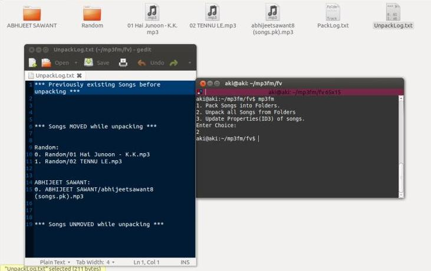

.. _screenshots:

*******************
Working Screenshots
*******************

    **Songs present in a folder**

    **Songs properties before Update where most of the fields are Unknown or Wrong**

    **Packing Songs where most of the them move into Random folder as their properties are Broken or Wrong**
    **Pack Log file also shown**

    **Unpacking Songs from folders**
    **Unpack Log file shown**

    **Songs properties repaired fully after Update so that iPod/Music Players can read songs properly and packing occurs efficiently**

    **Songs packed much efficiently as compared to the packing done before Updating them**

